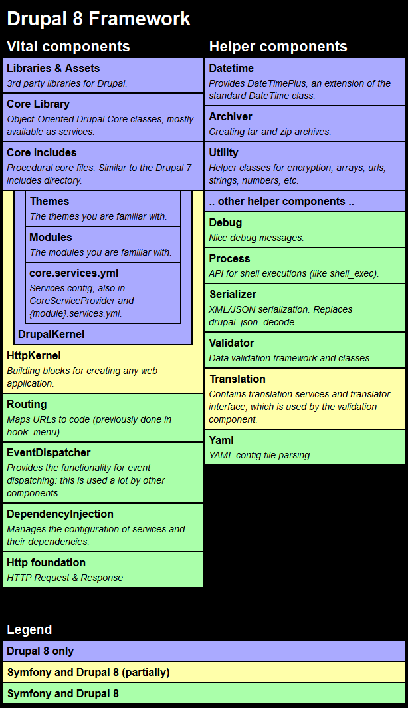
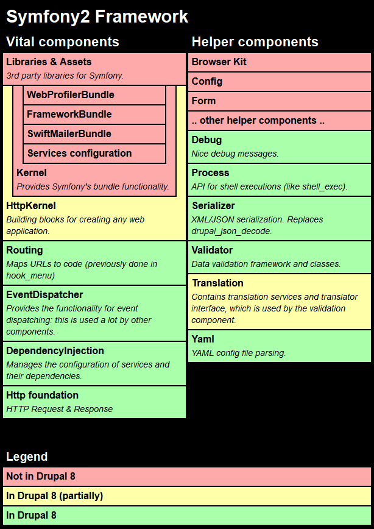

title: Intro to Backend | @digitalechidna | @sugaroverflow
class: animation-fade
layout: true

---

class: impact
# Intro to Backend
## Drupal Training Week 5

### Fatima | fkhalid@echidna | @sugaroverflow

---

# Modules
## tldr; lots of functionality out of the box
- Core
- Contrib
- Custom

---

# How a Drupal site loads
## Page Call Process

.col-2[
### Request
HTTP request to the website.
]
.col-2[
### Router
Prepares the request to be processed.
]
.col-2[
### Controller
Builds the response for the given request.
]
.col-2[
### View
Creates the response.
]
.col-2[
### Response
What the website returns a the end of the call.
]


???
#### Request
For example requesting the homepage of the site.
Symfony kernel uses a request object - Drupal adds data to it, for example, the current user or language.


#### Router
Lets say the user and current language are added to the request. The router now matches the URL to a class and method that can process the request but doesn't do the work. Also checks access.


#### Controller
Returns the render array - or array of items that will be displayed on the page. For example, this may include the blocks the user can access.

#### View
Drupal will render the view using the Twig templating system.

#### Response
What the website returns at the end of all of this. It might be HTTP 200 OK or 404 nto found.

---
class: impact

# The Drupal 8 framework.


---

# Drupal 8 | PHP
- PHP provides a lot of useful `magic methods`

.col-6[

```php
__call()
__clone()
__toString()
__debuginfo()
__isset()
```
]

.col-6[

```php
_construct()
__destruct()
__get()
__set()
__invoke()
```
]
---

# Drupal 8 | YAML
## YAML Ain't Markup Language

- human-readable data serialization language
- commonly used for configuration files

```yaml

name: 'YAML example'
type: module
description: 'Example for demonstration.'
package: Example
version: VERSION
core: 8.x
```
---
### Drupal 8 | Symfony

.col-6.seventy[]
.col-6.seventy[]

???
- Symfony is a set of reusable PHP components and a PHP framework to build web applications.
- not all of the Symfony2 Framework was included in Drupal

---

# Drupal 8 | [Hooks](https://api.drupal.org/api/drupal/core%21core.api.php/group/hooks/8.2.x)
## a way to alter Drupal core behavior or another module

- Understanding hooks by a real world example:
  - It's Movie Night
  - Your friend, Drupal, gets up to get a soda.
  - and asks if you want anything?

.col-6[
```php
function drupal_soda {
  $drink_of_choice = 'soda';
  return $drink_of_choice;
}
```
]
.col-6[
```php
function mymodule_soda_alter {
  $drink_of_choice = 'water';
  return $drink_of_choice;
}
```
]

???
- Friends hanging out for a movie night
- Friend "Drupal" gets up to get soda
  - Now – this is a naturally occurring event in the Drupal environment.
- Drupal says "Does anyone else want soda?"
- You can take advantage of Drupal’s already occurring functionality, which is what?

  Drupal is getting up off the couch, walking to the refrigerator, opening the refrigerator, grabbing a soda, closing the refrigerator and walking back to the couch.

- so you raise your hand.

Maybe you want a soda too, or a water, or a cider, or you want Drupal to sit down and stop getting soda.  You can add what you need to happen in Drupal’s environment by hooking into the Soda Hook and adding your functionality.

---
# Drupal 8 | Hooks

- `hook_form_alter`
  - Alter to output of forms before they’re rendered on a page
- `hook_js_alter`
  - Performs alternations to JavaScript before it’s presented
- `hook_install`
  - Perform setup tasks when the module is installed

## To Find the Correct Hook:
- Look at list of hooks on [api.drupal.org](api.drupal.org)
- Read the documentation
- Look at other modules

---

class: impact
# Drupal 8 | OOP

---
# Object Oriented Programming

## OOP is a way to organize our code

- modular
- reusable
- flexible

## creating "extensible containers"
???

---

# OOP | Namespaces
## Drupal requires you to use namespaces

- PS4 standard
- allows you to use simple class names

```php
  namespace Drupal\my_module\Form;
  class SignUpForm {
    //...do something
  }
```

```php
  namespace Drupal\drupal_training\Form;
  class SignUpForm {
    //...do something
  }
```
???
Classes, interfaces, functions and constants are affected by namespaces.

The purpose of namespaces is to allow you to name your module’s classes in a simple pragmatic way without worrying about another module or plugin using the same name.

Namespaces are declared using the NAMESPACE (all lower) keyword.   A file containing a namespace must declare the namespace at the top of the file before any other code.

Drupal uses the PSR-4 standard for Namespaceing .

---

# OOP | Classes
## Classes are like blueprints

- Properties
  - data points

- Methods
  - class-specific functions

```php
class BookOutlineForm {
  protected function actions(array $form, FormStateInterface $form_state) {
    $actions['delete']['#title'] = $this->t('Remove from book outline');
    return $actions;
  }
}
```

---
# OOP | Interfaces
## Interfaces are like contracts

- all methods are public
- the class must implement the methods

```php
namespace Drupal\Core\Form;
interface FormInterface {
  public function getFormId();
}
```

```php
namespace Drupal\my_module\Form;
class SignUpForm implements FormInterface {
  public function getFormId() {
    return 'sign_up_form';
  }
}
```

???

- create code that specifies what classes must implement
- but without defining those methods
- to change the behavior of existing property or method in the new class, just overwrite in the new class with what you need
- interface keyword
- empty method bodies

---
# OOP | Services
## services are like pluggable operations

- core services are defined in `core.services.yml`:
```php
  current_user:
    class: Drupal\Core\Session\AccountProxy
```
- so if you want to load the current user:
```php
 $user = \Drupal\user\Entity\User::load(\Drupal::currentUser();
```
- you can also define custom services

???
- package reusable functionality in one place to perform an operation like sending an email or database query.
- the operation always stays the same

Core services are defined in core.services.yml

You might define your own services if you need to write custom

---
# OOP | Plugins
## plugins are like lego blocks with functionality

- swappable
- different types
- can define custom ones

.col-6[
```php
abstract class BlockBase {
    public function build() {
      // does basic stuff
    }
}
```
]

.col-6[
```php
class CustomBlock extends BlockBase {
  public function build() {
    // custom stuff
  }
}
```
]

???


---
# OOP | Resources
## just the beginning of OOP

### Many resources for learning OOP are available
  - http://php.net/manual/en/language.oop5.php
  - http://code.tutsplus.com

### Resources for Drupal 8
- api.drupal.org
- www.drupal.org/documentation/develop
- http://www.drupalcontrib.org/api/drupal/8
- https://www.drupal.org/coding-standards

---
class: impact
## Workshop
# My First Module

---
# Workshop Class 5 | Overview

### Create a module that:
  - Alters a core Drupal form
  - Defines a path to a custom page
  - Defines a menu item for that path


---
# 5.1: Create a Module

- Create your module directory
  - `/modules/custom/mymodule`
- Create a `info.yml` file
  - `/modules/custom/mymodule.info.yml`

```yaml
name: My First Custom Module
type: module
description: ‘This is the first module I’ve created.’
core: ‘8.x’
package: ‘Custom’
dependencies:
- book
```
- saved, FTP upload, and enable your module

---
# 5.2: Hook into a Form
Go to api.drupal.org
Set to Drupal 8
Search for hook_form_alter

- Change the "Comment" button label for Blog content type.
- Create a module file
  - `/mymodule/mymodule.module`
- Add a `hook_form_alter` and flush cache:

```php
<?php
use Drupal\Core\Form\FormStateInterface;

function mymodule_form_alter(&$form, FormStateInterface $form_state, $form_id) {
  if ($form_id === 'blog_node_form') {
    $form['actions']['submit']['#value'] = t('Save Blog');
  }
}
```


---
# 5.3 - Add Pages and Menu Items 1/4
## Lets set up our route
- Create a routing file: `mymodule.routing.yml`

```php
mymodule.content
  path: `/mymodule`
  defaults:
    _controller: '\Drupal\mymodule\Controller\FirstController::content'
  requirements:
    _permission: 'access content'
```

---
# 5.4 - Add Pages and Menu Items 2/4
## Lets create a controller
- In `custom/mymodule`, create a `src` folder
  - in `src`, create a `Controller` folder
  - in `Controller`, create a `FirstController.php` file
- You should have:
  - `custom/mymodule/src/Controller/FirstController`

---
# 5.4 - Add Pages and Menu Items 3/4
## Lets add code to our controller
- Add code to your controller
- FTP upload, clear cache, & go to `yoursite/mymodule`

```php
namespace \Drupal\mymodule\Controller;
use \Drupal\Core\Controller\ControllerBase;

class FirstController extends ControllerBase {
  public function content {
    return [
      '#type' => 'markup',
      '#markup' => t('This is my menu linked custom page'),
    ];
  }
}
```

---
# 5.4 - Add Pages and Menu Items 4/4
## Lets add a custom menu link to our page
- Create a `mymodule/mymodule.links.menu.yml` file
- FTP upload, clear cache, & go to `yoursite`

```yaml
mymodule.newpage:
  title: 'MyModule Stuff'
  description: 'Link to the page created by mymodule'
  route_name: mymodule.content
  menu_name: main
  weight: 100

```

---
# Class 5 Recap
### Overview of the Drupal backend
.col-6[
- Modules
- PHP
- YAML
]
.col-6[
- Symfomy
- the page call process
- OOP
]

### Essential Module Building
- `info.yml` file
- `.module` file and adding a `hook_form_alter`
- creating a custom route on our site: `mymodule.routing.yml`
- creating a controller: `mymodule/src/Controller/FirstController`
- building a response in the controller for our page:`FirstController::content()`
- creating a custom menu link: `mymodule.links.menu.yml`


